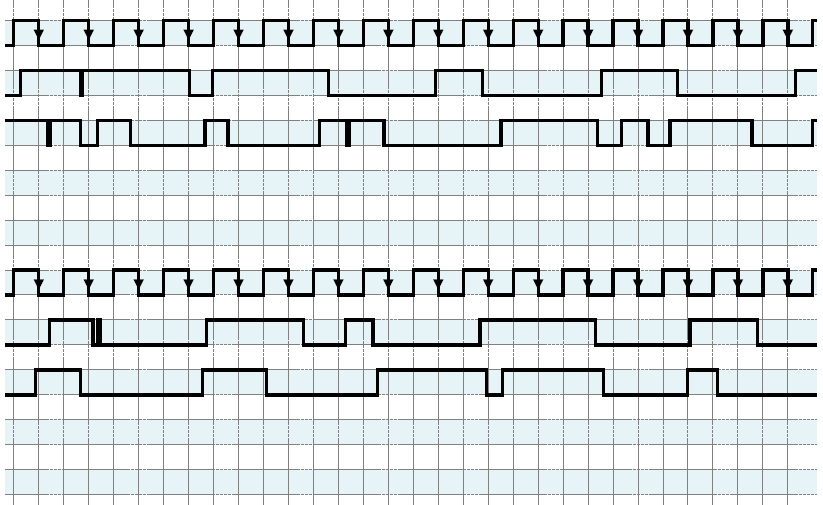

# Timing Diagram Generator

This repository contains a Python script for generating timing diagrams useful for digital circuits lessons in school. The script creates customizable waveforms and clock signals, exporting them as a multi-page PDF.

## Sample Output



## How to Use

1. **Install requirements**  
   Make sure you have Python 3 and `matplotlib` installed:
   ```
   pip install matplotlib
   ```

2. **Run the script**  
   Execute the script in your terminal:
   ```
   python main.py
   ```

3. **Output**  
   The script will generate a file named `timing-circuits.pdf` in the current directory, containing several pages of timing diagrams.

## Customization

- You can adjust the number of signal patterns, output patterns, and pages by changing the values of `SIGNAL_PATTERN`, `OUTPUT_PATTERN`, and `PAGE_NB` at the top of `main.py`.
- The appearance of the diagrams (such as grid size and colors) can be modified in the respective functions.

---
*This tool is designed to help students and teachers prepare exercises